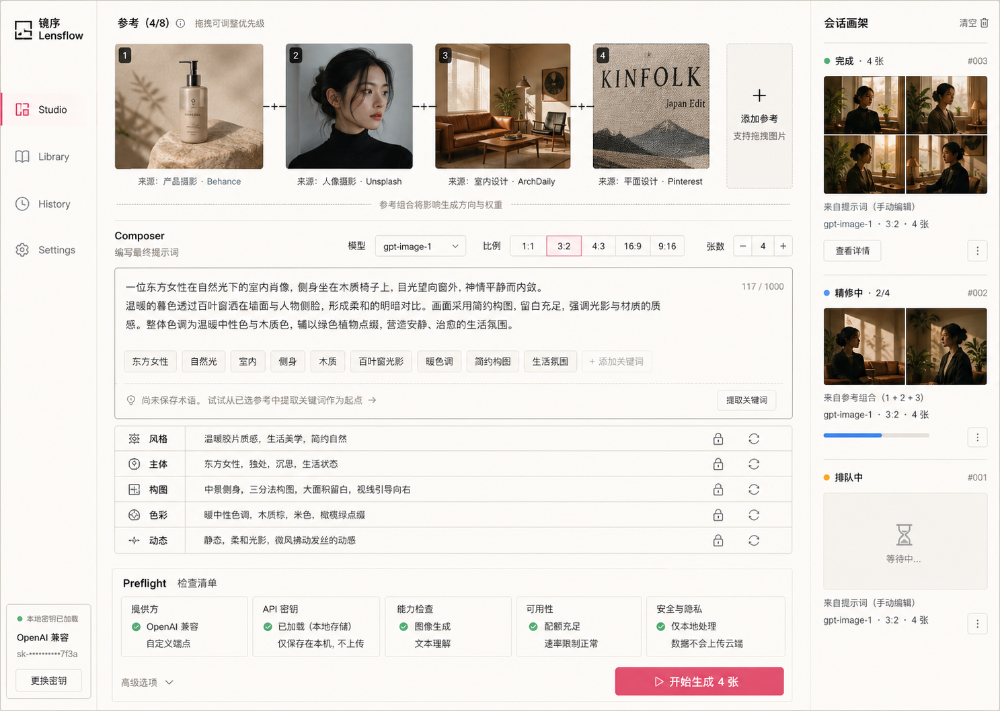
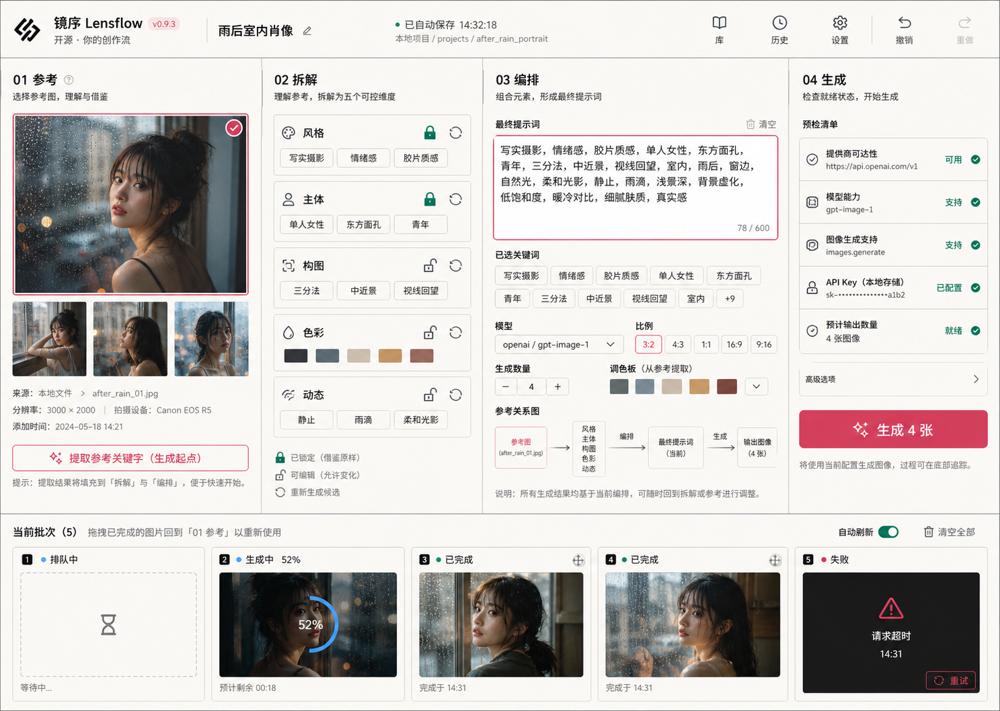
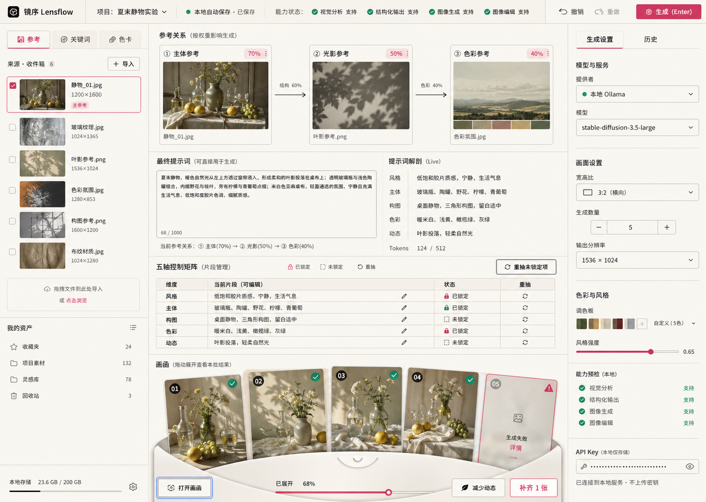
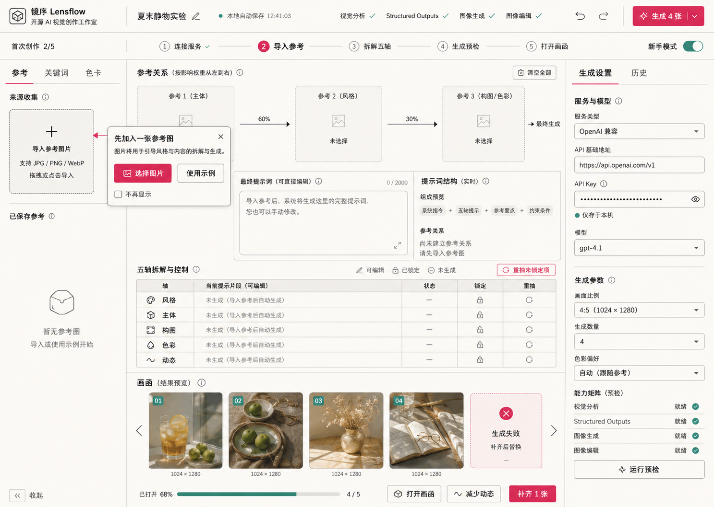

# Lensflow UI Directions

Status: `PARTIAL`. The Precision Creative Workbench is the experienced-user default and the Guided Precision Workbench has been implemented as a persistent first-run state. The images remain design evidence, not pixel-level acceptance screenshots.

All images in this folder are original AI-generated design explorations created for Lensflow on 2026-08-28. They are product targets, not screenshots of implemented software.

## Visual system

- Warm paper: `#F4F0E8`
- Ink: `#171717`
- Rose: `#D94D78`
- Jade: `#1E8D80`
- Small radii, thin rules, restrained elevation and a precise editorial grid.
- Chinese sans-serif for interface text and one restrained mono face for metadata.
- No gradients, decorative orbs, nested cards or oversized marketing type inside the workbench.

## Explorations

### Reference Ribbon Composition

A top reference ribbon, central Composer and right session easel. It makes source relationships immediately visible but gives references more vertical priority than the final selected direction.

### Horizontal Atelier Workflow

A left-to-right sequence from reference through decomposition, composition and generation, with a persistent bottom batch tray. It is easy to learn but less flexible for expert nonlinear editing.

### Precision Creative Workbench - selected default

The selected experienced-user layout. The implementation preserves the source library, central five-step work area and integrated result reveal; at 1024 px the Provider inspector collapses to protect the working width.

### Guided Precision Workbench - first-run state

The same architecture with a five-step progress strip and inline import guide. This is an onboarding state, not a separate product or permanent simplified mode.

## Implementation rules

- Preserve the selected workbench hierarchy rather than copying generated text literally.
- Use real accessible controls and Lucide icons.
- Keep the prompt editor readable and the reveal tray compact.
- Detailed capability probes belong in the right inspector, not the global header.
- The first-run guide is dismissible, recoverable and driven by real completion events.
- Narrow screens use staged views; do not compress three columns until text or controls overlap.

## Third-party boundary

Viko screenshots and captured media are not included. The concepts may contain generic AI-generated imagery and illustrative source labels; they do not imply affiliation with any referenced publication, platform or Provider. Product code must use appropriately licensed or newly generated assets with an asset ledger before release.
